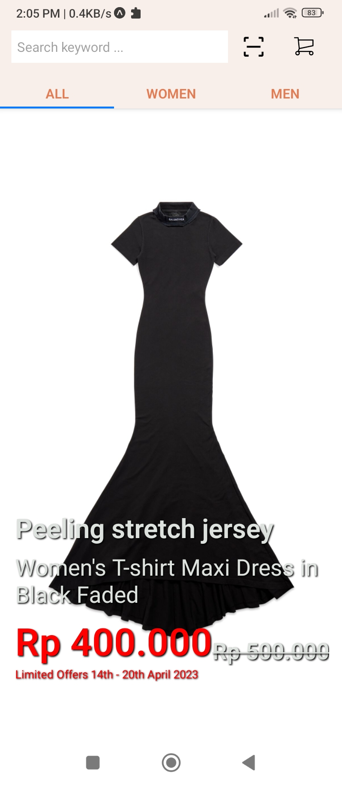
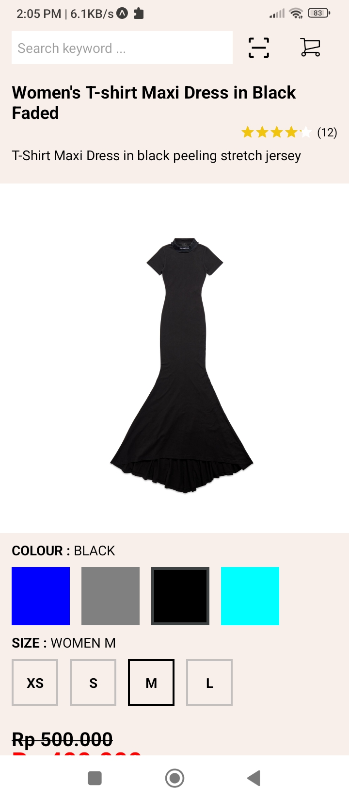
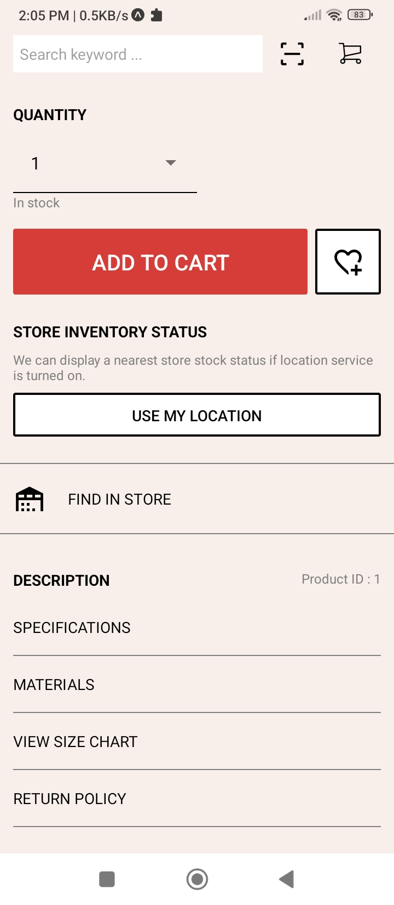
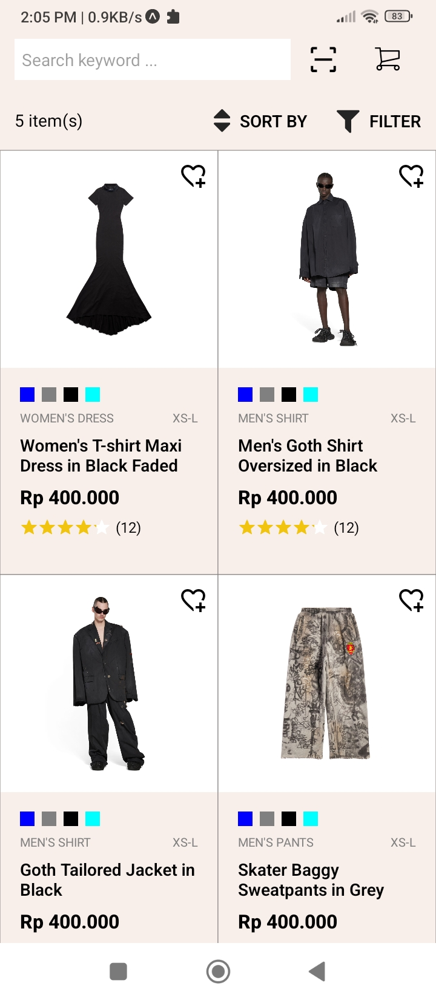
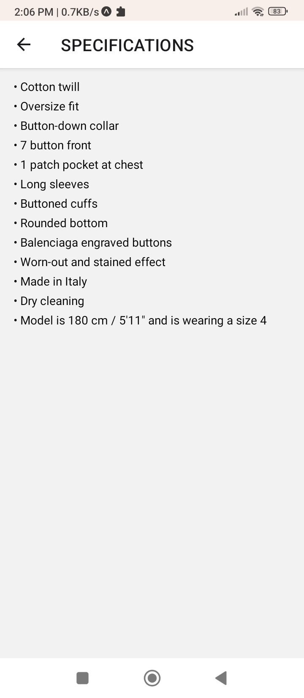

# Balenciaga Mobile

A simple app to display balenciaga products. Created withReact Native, Apollo Server and Client, along with microservice with express for the main app and for user data.

# Screenshots

